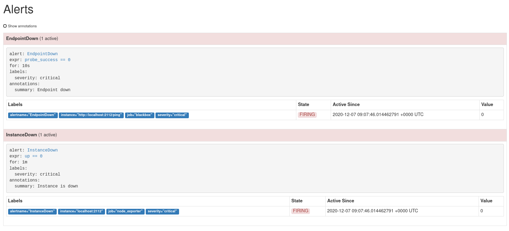
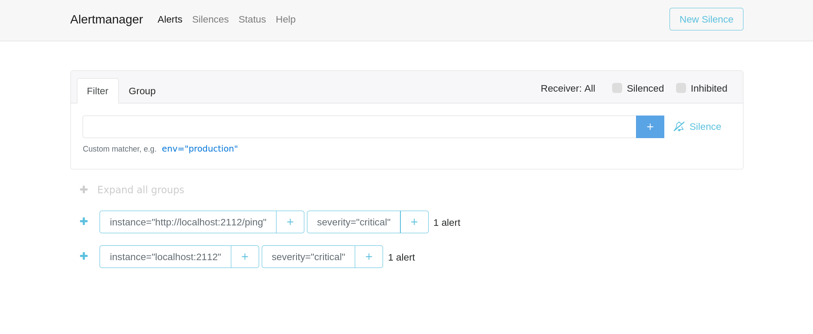
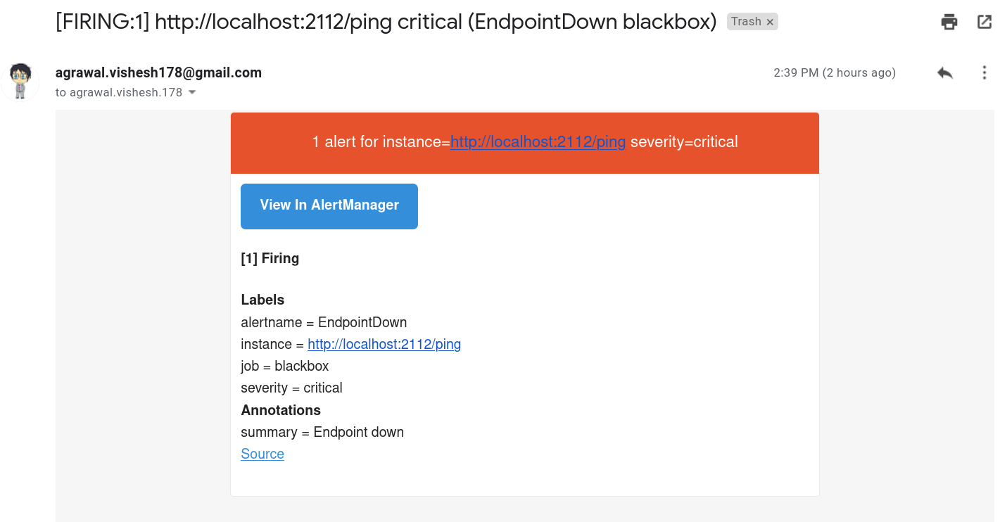

# anzibl

anzibl is a devops assignment task. The objectives are as follows:

### Create an ansible script that does the following:

- [x] Create a small EC2 or DO Instance
- [x] Run a small HTTP server (preferably in Golang) with a ping endpoint
- [x] Run prometheus on the same machine to monitor ping endpoint and raise an alert over email when either:
	- HTTP server process is crashed
	- Ping endpoint is not responding

### With the following features being great to haves / bonuses:

- [ ] Make the whole thing idempotent

### Prerequisites

- An `aws` account.
- Ensure that the security group you create has port `2112` open to incoming HTTP requests.
- `python3`
- Some patience :)

### Steps to replicate

#### Install ansible, boto3 and awscli

```bash
$ python -m pip install --user ansible
$ python -m pip install boto3
$ python -m pip install awscli
```

#### Clone the project locally
```bash
$ git clone https://github.com/awalvie/anzibl.git
$ cd anzibl
```

#### Use `ansible-galaxy` to install roles for `postify` and `golang`
```bash
$ ansible-galaxy install -r roles/requirements.yml
```

#### Set your aws credentials

Set both your `access_key_id` and `secret_access_key` securely using the `awscli`.

```bash
$ aws configure set --profile work aws_access_key_id <access_key_id >
$ aws configure set --profile work aws_secret_access_key <secret_access_key >
```

Now add your preferred `aws` configuration to `group_vars/all/ec2_vars.yml`.

#### Configure `postfix`

Currently the project only supports sending out emails using `gmail`. If you configure your Google account for extra security to use the 2-step verification, then postfix won't send out emails anymore and you might notice error messages in the `/var/log/mail.log` file

To fix this issue, you need to visit the [Authorizing applications & sites](http://www.google.com/accounts/IssuedAuthSubTokens?hide_authsub=1) page under your Google Account settings. On this page enter the name of the application to be authorized (Postfix) and click on Generate button. Set the `sasl_password` variable with the password generated by this page.

- For `postfix`
Set your `sasl_username` and `sasl_password` in `group_vars/all/postfix.yml`

- For `alertmanager`
Set you `sasl_username` in `roles/alertmanager/vars/main.yml`

- Finally, let it rip
```bash
$ AWS_PROFILE=work ansible-playbook site.yml 
```


### Steps taken to make the project
I documented all the steps I took consistently which was the sole reason why I was able to accomplish the task. You can find it in [steps_taken](./STEPS_TAKEN.md)

### Screenshots

#### Prometheus tracking alerts


#### Alertmanager tracking failures


#### Emails received

