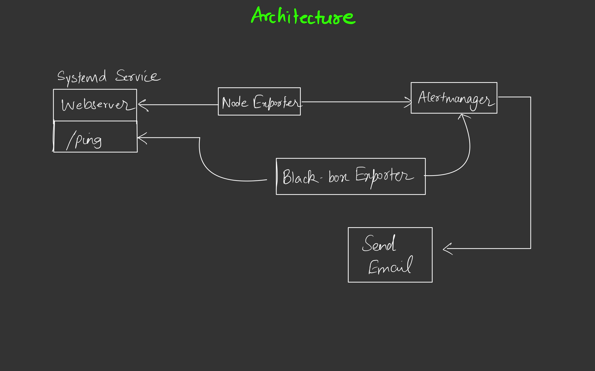

# anzibl

anzibl is a devops assignment for an internship at sendpost.io. The objectives are as follows:

### Create an ansible script that does the following:

- [x] Create a small EC2 or DO Instance
- [x] Run a small HTTP server (preferably in Golang) with a ping endpoint
- [ ] Run prometheus on the same machine to monitor ping endpoint and raise an alert over email when either:
	- HTTP server process is crashed
	- Ping endpoint is not responding

### With the following features being great to haves / bonuses:

- [ ] Make the whole thing idempotent

### Breaking down the task into atomic steps

- [x] Read up on ansible for a quick primer
- [x] Setup a sensible initial directory structure
- [x] Find resources for deploying to AWS with Ansible
- [x] Create a small EC2 instance
- [x] Connect to the instance using ssh and install dependencies
- [x] Read up on how to write a HTTP Server in Golang
- [x] Write the server with a ping endpoint
- [ ] Figure out how to monitor the server with prometheus
- [ ] Setup the alerts in prometheus
- [ ] Try out the architecture locally to test if it works
- [ ] Automate with ansible

### Steps taken

- [x] Explore what ansible is, it's common use cases, best practices and read the getting started part of the docs
- [x] The directory structure was taken from ansible's official documentation [here](https://docs.ansible.com/ansible/latest/user_guide/sample_setup.html#sample-directory-layout).
- [x] Found [aws_guide](https://docs.ansible.com/ansible/latest/scenario_guides/guide_aws.html). Create new IAM user and provision `secret_access_key` and `access_id`.
- [x] Install `aws-cli` and configure a work profile with `access_id` and `secret_access_key`.
- [x] Create a security group in the aws console named `test`.
- [x] Write a playbook that creates a `Key Pair` and `Provisions EC2 Instance`.
- [-] Refactor code to move `aws` things to a separate role.
	- Can't do this. Since we don't have a text file with all our hosts, we're dependent on the playbook variable `ec2hosts` for fetching the details for our aws machines. So the rest of the actions can then be put into roles.
- [x] Figure out how to connect to the instance and do things on it.
- [x] Make the `aws` deployment process idempotent.
- [x] Use ansible galaxy to find roles for both prometheus and go and setup requirements file to install them.
- [x] Test to see if they work.
- [x] Make a small diagram to figure out how the architecture looks.
- [x] Write an HTTP server in go with the ping endpoint locally.
- [x] Create a `systemd` service for the webserver.
- [x] Deploy this using ansible 
- [ ] Use `node_exporter` and `blackbox_exporter` to monitor the webserver locally.
- [ ] Register both of the ^ to Alertmanager
- [ ] Setup SMTP for sending out emails
- [ ] Send emails via Alertmanager
- [ ] Rejoice!

#### Architecture

### TODOs

- [ ] Create a new security group during deployment.
- [ ] If instance already exists don't wait for ssh to come up
